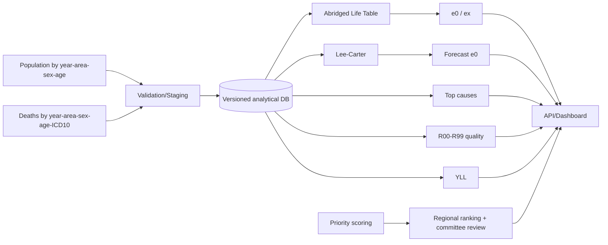

# HR1-LE

ระบบต้นแบบสำหรับ **Life Expectancy (e₀/eₓ), Abridged Life Table, Mortality Burden, Lee–Carter Forecast และ WHO Priority** สำหรับ **เขตสุขภาพที่ 1** ครอบคลุม 8 จังหวัดภาคเหนือตอนบน:

- เชียงใหม่
- เชียงราย
- ลำพูน
- ลำปาง
- พะเยา
- แพร่
- น่าน
- แม่ฮ่องสอน

โครงการนี้เริ่มจากการทำ Technical Reverse Engineering ของ [le-uthaihealth.com](https://le-uthaihealth.com/) และแปลงเป็น specification ที่ตรวจสอบย้อนกลับได้ เพื่อใช้ต่อยอดเป็นระบบระดับเขตสุขภาพ โดย **ไม่อ้างว่าเป็น source code หรือ schema ภายในของเว็บต้นทาง** ในส่วนที่ยังไม่มีหลักฐานตรง

## เป้าหมาย

1. ทำ Data Contract กลางของข้อมูลประชากรและการตายสำหรับ 8 จังหวัด
2. คำนวณ Abridged Life Table แบบ reproducible
3. เปรียบเทียบ e₀/eₓ ระหว่างจังหวัด/ปี/เพศ
4. Forecast e₀ ด้วย Lee–Carter จาก age-specific mortality
5. วิเคราะห์ YLL / Top causes / R00–R99 data quality
6. สนับสนุนการจัดลำดับปัญหาสุขภาพด้วย WHO-derived priority framework
7. มี ETL, validation, lineage, versioning และ audit trail พร้อมใช้ระดับเขต
8. เตรียม architecture สำหรับ dashboard/API และการ deploy บน server กระทรวง

## สถานะหลักฐาน

ใช้ระดับความเชื่อมั่น 4 ระดับ:

- **CONFIRMED** — มีหลักฐานตรงจากเว็บต้นทางหรือเอกสารต้นฉบับ
- **HIGH** — สอดคล้องหลายแหล่งและมี methodological lineage ชัดเจน
- **PROPOSED** — แบบที่ออกแบบเพื่อให้ใช้งานระดับเขตได้ แต่ไม่อ้างว่าเว็บต้นทางใช้แบบเดียวกัน
- **UNKNOWN** — ต้องขอ template / HAR / source / API เพิ่มเติมก่อนยืนยัน

## โครงสร้าง repository

```text
HR1-LE/
├─ README.md
├─ AGENTS.md
├─ docs/
│  ├─ 00_PROJECT_SCOPE.md
│  ├─ 01_REVERSE_ENGINEERING_BASELINE.md
│  ├─ 02_HR1_DATA_ARCHITECTURE.md
│  ├─ 03_DATA_DICTIONARY.md
│  ├─ 04_IMPORT_TEMPLATE_SPEC.md
│  ├─ 05_LIFE_TABLE_FORMULAS.md
│  ├─ 06_LEE_CARTER_FORECAST.md
│  ├─ 07_WHO_PRIORITY.md
│  ├─ 08_ETL_AND_VALIDATION.md
│  ├─ 09_API_AND_DATABASE.md
│  ├─ 10_HR1_IMPLEMENTATION_ROADMAP.md
│  └─ 11_RESEARCH_BACKLOG.md
├─ research/
│  └─ SOURCE_REGISTER.md
├─ db/
│  └─ schema.sql
├─ reference/
│  ├─ life_table.py
│  ├─ lee_carter.py
│  └─ priority.py
└─ tools/
   └─ generate_import_template.py
```

## Analytical flow



## Critical conformance gaps

การทำให้ตรง le-uthaihealth แบบ 1:1 ยังต้องมีอย่างน้อยหนึ่งอย่าง:

1. blank/example upload workbook จากระบบต้นทาง
2. successful upload workbook + validation response
3. HAR/Network capture ของ successful upload
4. source/API specification

สิ่งนี้จะช่วยปิด uncertainty เรื่อง exact headers, zero-death policy, Lee–Carter adjustment, forecast interval และ internal API contract

## เริ่มงานรอบถัดไป

อ่านตามลำดับ:

1. `docs/01_REVERSE_ENGINEERING_BASELINE.md`
2. `docs/03_DATA_DICTIONARY.md`
3. `docs/04_IMPORT_TEMPLATE_SPEC.md`
4. `docs/05_LIFE_TABLE_FORMULAS.md`
5. `docs/06_LEE_CARTER_FORECAST.md`
6. `docs/08_ETL_AND_VALIDATION.md`
7. `docs/10_HR1_IMPLEMENTATION_ROADMAP.md`
8. `docs/11_RESEARCH_BACKLOG.md`

## Data governance

ระบบระดับเขตควรใช้ aggregate data เป็นหลัก และแยก person-level staging ออกจาก analytical warehouse หากจำเป็นต้องตรวจสอบคุณภาพข้อมูลรายบุคคล โดยต้องมีสิทธิ์เข้าถึง, retention policy, audit trail และการจัดการข้อมูลตามกฎหมาย/ระเบียบที่เกี่ยวข้อง
