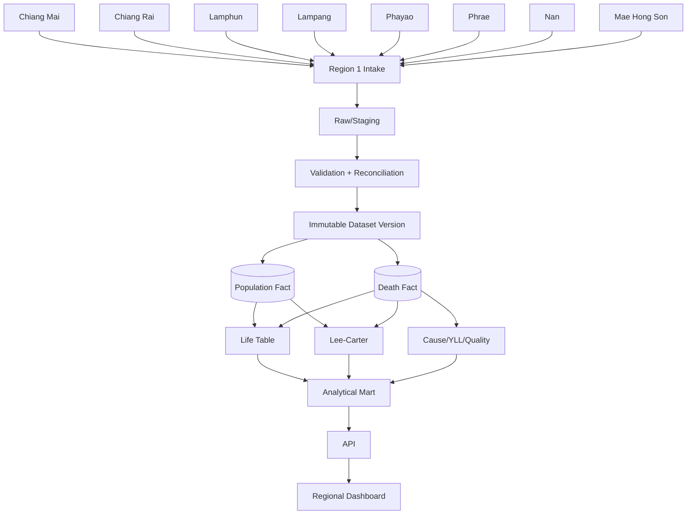

# 02 — Health Region 1 Data Architecture

## Design goal

One regional data contract, eight provincial source pipelines.

## Source-of-truth hierarchy

1. raw uploaded source file + checksum
2. normalized/staging rows
3. published immutable fact tables
4. derived analytical results
5. dashboard/cache

Never treat dashboard values as source facts.

## Geography model

`region → province → district → subdistrict`

Recommended:
- use official geography code dictionary
- store code as text
- allow parent-child validation
- freeze geography dictionary by version if administrative codes change

## Regional dataset version

Every publish should carry:
- dataset_version
- source cutoff
- imported_at
- published_at
- province coverage
- source years
- population source
- mortality source
- ICD mapping version
- age mapping version
- life-table algorithm version
- Lee-Carter model version

## Regional comparison policy

A province should not enter the comparative dashboard for a year if:
- population/death age bands are incomplete
- terminal open interval is absent
- population and death geography do not align
- source cutoff differs materially without annotation
- data-quality warning exceeds agreed publication threshold
