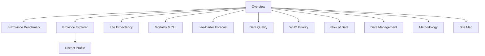

# 13 — Site Map and Wireframes

## Full site map



## W01 — Regional Overview

```text
┌─────────────────────────────────────────────────────────────────────┐
│ Header: Health Region 1               [Year ▼] [Sex ▼]              │
├───────────────┬───────────────┬───────────────┬─────────────────────┤
│ e0            │ mortality     │ R00-R99       │ completeness        │
│  xx.xx years  │ xxx /100k     │ x.x%          │ xx.x%               │
├─────────────────────────────────────────────────────────────────────┤
│ 8 Province cards                                                    │
│ [เชียงใหม่] [เชียงราย] [ลำพูน] [ลำปาง] ...                       │
│ district count + e0                                                 │
├───────────────────────────────────┬─────────────────────────────────┤
│ e0 trend                          │ interpretation / QA banner      │
└───────────────────────────────────┴─────────────────────────────────┘
```

## W02 — 8-Province Benchmark

```text
┌─────────────────────────────────────────────────────────────────────┐
│ Data-quality comparability notice                                   │
├─────────────────────────────────────────────────────────────────────┤
│ Province | e0 | Mortality | YLL rate | R-code | Districts | Detail │
├─────────────────────────────────────────────────────────────────────┤
│ comparative horizontal bars                                         │
└─────────────────────────────────────────────────────────────────────┘
```

## W03 — Province Explorer

```text
┌─────────────────────────────────────────────────────────────────────┐
│ Province selector [เชียงราย ▼]       18 districts                  │
├───────────────┬───────────────┬───────────────┬─────────────────────┤
│ e0            │ mortality     │ R-code        │ district count      │
├─────────────────────────────────────────────────────────────────────┤
│ District | e0 | mortality | R-code | completeness | subdistricts   │
│ เมือง      ...                                                       │
│ เวียงป่าเป้า ...                                                    │
│ ...                                                                  │
└─────────────────────────────────────────────────────────────────────┘
```

## W04 — District Profile

```text
┌─────────────────────────────────────────────┬───────────────────────┐
│ KPI: e0 / mortality / R-code / completeness│ administrative profile│
├─────────────────────────────────────────────┴───────────────────────┤
│ e0 trend                         | top causes                        │
├─────────────────────────────────────────────────────────────────────┤
│ life-table preview: nMx nqx lx Lx Tx ex                             │
└─────────────────────────────────────────────────────────────────────┘
```

## W05 — Life Expectancy

```text
┌─────────────────────────────────────────────────────────────────────┐
│ Region e0 | Male e0 | Female e0 | Algorithm version               │
├─────────────────────────────────────────────────────────────────────┤
│ Province comparison                                                 │
├─────────────────────────────────────────────────────────────────────┤
│ Formula chain / methodological drawer                               │
└─────────────────────────────────────────────────────────────────────┘
```

## W06 — Mortality / YLL

```text
┌─────────────────────────────────────────────────────────────────────┐
│ Deaths | crude rate | total YLL | R-code                            │
├─────────────────────────────────────────────────────────────────────┤
│ Top causes: ICD | cause group | deaths | rate | YLL                 │
├─────────────────────────────────────────────────────────────────────┤
│ age × sex cause detail                                               │
└─────────────────────────────────────────────────────────────────────┘
```

## W07 — Lee-Carter Forecast

```text
┌─────────────────────────────────────────────────────────────────────┐
│ Fit window | zero policy | horizon | model status                   │
├─────────────────────────────────────────────────────────────────────┤
│ Observed e0 ──────── forecast e0                                    │
├───────────────────┬───────────────────┬─────────────────────────────┤
│ inputs            │ parameters        │ validation / backtest       │
└───────────────────┴───────────────────┴─────────────────────────────┘
```

## W08 — Data Quality

```text
┌─────────────────────────────────────────────────────────────────────┐
│ publish-ready | completeness | R-code | sparse-cell warning         │
├─────────────────────────────────────────────────────────────────────┤
│ Province | completeness | R% | zero cells | PASS/REVIEW             │
├─────────────────────────────────────────────────────────────────────┤
│ hard fail / warning details                                          │
└─────────────────────────────────────────────────────────────────────┘
```

## W09 — WHO Priority

```text
┌─────────────────────────────────────────────────────────────────────┐
│ governance notice: computed rank ≠ final decision                   │
├─────────────────────────────────────────────────────────────────────┤
│ 7 criteria cards (1–5 rubric)                                       │
├─────────────────────────────────────────────────────────────────────┤
│ computed result → committee review → final consensus                │
└─────────────────────────────────────────────────────────────────────┘
```

## W10 — Data Flow

```text
8 provinces → upload/API → checksum → staging → validation
→ reconciliation → approval → immutable dataset version
→ facts → life table / Lee-Carter / burden / quality
→ analytical mart → API → dashboard
```

## W11 — Data Management

```text
RECEIVED → HASHED → NORMALIZED → VALIDATED → RECONCILED
→ APPROVED → PUBLISHED

Province Data Manager | Region Analyst | Regional Approver
```

## W12 — Methodology

Shows:
- formula
- age dictionary / nax
- terminal interval rule
- Lee-Carter specification
- model/mapping versions
- references

## Mobile behavior

On screens <820px:
- left navigation becomes drawer
- KPI cards stack
- tables scroll horizontally
- province cards stack
- complex model diagnostics become vertical sections
