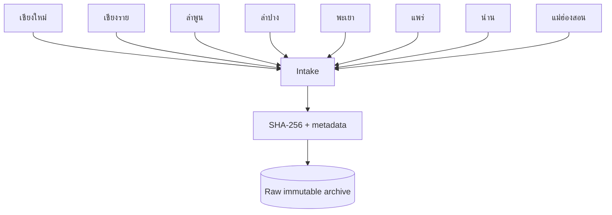
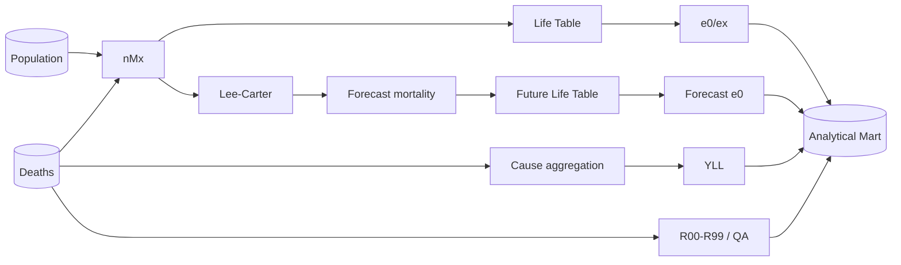

# 14 — Full Flow of Data: Health Region 1

## 1. Source layer

Two canonical source families are required.

### Population
Preferred regional agreement should define one source for:
- year
- geography of residence
- sex
- age group
- population/exposure

The Anamai DataCatalog dataset for Health Region 1 describes registered population data from the Bureau of Registration Administration, Department of Provincial Administration, grouped by sex and 5-year age groups. It is a useful source candidate/reference, but the final denominator definition must be formally agreed for the project.

### Mortality
The regional project must define:
- mortality source system
- underlying-cause field
- residence rule
- finalization lag/cutoff
- duplicate/correction handling
- ICD version

## 2. Provincial intake



## 3. Normalize

Normalize:
- BE/CE year
- official area codes
- M/F source sex
- age-group labels
- ICD formatting
- numeric types
- source metadata

Never silently discard unknown values; quarantine or explicitly map them.

## 4. Validation

### Hard fail
- missing required field
- invalid age group
- negative count
- deaths with zero denominator
- duplicate population grain
- missing open age interval
- invalid geography parent
- unresolvable year

### Warning
- high R00–R99
- unknown cause
- sparse/zero death cells
- denominator break
- incomplete province coverage
- suspicious year-to-year shifts

## 5. Reconciliation

Generate an import QA report:
- rows in/out
- population totals by province/year/sex
- deaths totals by province/year/sex
- age coverage
- cause coverage
- R-code %
- zero-cell profile
- cross-source geography match

## 6. Approval and versioning

```text
upload != publish

VALIDATED
→ regional analyst review
→ province correction if required
→ regional approver
→ immutable DATASET_VERSION
```

A correction creates a new version. Do not overwrite a published source fact.

## 7. Analytical layer



## 8. Serving layer

API filters:
- dataset_version
- year
- area_level
- area_code
- sex
- age_group
- cause_group

Every response must contain:
- dataset_version
- algorithm/mapping version
- generated timestamp
- filters

## 9. Website drill-down

```text
Region 1
  → Province
      → District
          → Subdistrict (future / controlled release)
```

District analysis is technically supported by the geography model. Public statistical output must still pass small-area privacy/stability rules.

## 10. Scheduled future ingestion

Production evolution can support:
- monthly population refresh
- mortality update/reconciliation cycle
- model refresh only when a new approved dataset version is published
- automated QA notification, not automated publication
